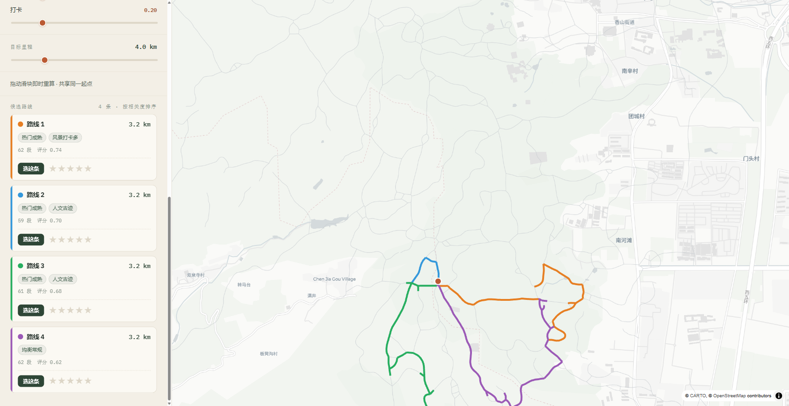

# T1.6 前端探索辅助交互 demo

工程线第二块交付：把后端 `/route` 服务（[T1.1](T1.1_backend_recommender.md)）接成可演示的端到端 demo。
源码：[frontend/](../frontend/)。设计：[docs/plans/2026-06-07-frontend-demo-design.md](../docs/plans/2026-06-07-frontend-demo-design.md)。运行说明：[frontend/README.md](../frontend/README.md)。

至此 **Phase 1 工程线闭环**：起后端 + 起前端即可在浏览器实地演示「拨偏好→看多条不同风格路线即时生成」。

## 1. 交付内容

单屏直玩：左栏控件（persona 预设 + 5 偏好滑块 + 目标里程），右侧 deck.gl 大地图。纯消费后端 5 接口、不改后端契约。

| 模块 | 实现 |
|---|---|
| 数据流 | App mount 自检 `GET /health` + 拉 `/personas`、`/trails`；`useRoute` 防抖 ~300ms 触发 `POST /route`，`AbortController` 只采纳末次响应（防快速拖动旧响应覆盖） |
| 地图 | deck.gl `GeoJsonLayer`：29,941 段 trails 底层（淡灰）+ 每条候选一层（色盲友好定性色板、active 加粗 6px 其余淡化 0.35）+ 起点 marker；底图 carto positron。点空白=取坐标设起点、点候选线=选中 |
| 控件 | persona 卡点选填充滑块（之后拖滑块脱离预设、请求传 `preferences` 不传 `persona`，符合后端 `resolve_prefs` 优先级）；5 滑块 0–1、距离 1–15km |
| 候选 | score 降序卡片：色点 + 里程 + `labels` chip + 反馈（「选这条」+1–5 星 → `POST /feedback`）；卡片↔地图双向高亮、其余淡化 |
| 状态/边界 | health 红/绿；`reachable=false` 顶部黄条显后端 `note`（如"该片区最多约 2.3km"）；请求失败红条；空起点引导 |

## 2. 实测（真实后端，非 mock）

浏览器自动化（Playwright）对 `localhost:5173` ←proxy→ `127.0.0.1:8000` 全栈跑通：

- `/health` `/personas` `/trails` 启动加载 → 品牌头显 "后端就绪 · 29,941 段 · 5 画像"、5 张 persona 卡、底图步道网。
- 地图点选起点 (116.18, 39.97) → `POST /route 200` → **4 条不同色候选**同屏渲染 + 左栏 4 张卡片（见下图）。
- persona 卡点选 → 5 滑块即时填充其 `default_prefs`（验证 onboarding 路径）。
- 稀疏片区起点 → `reachable=false` + note → 黄条正确提示（验证不可达分支）。

*起点 (116.18, 39.97)、目标 4km：MMR 多样性给出 4 条 ~3.2km 不同走向候选，橙/蓝/绿/紫按 score 降序固定配色；左栏卡片与地图线一一对应。*

## 3. 质量

- `npm run build`：`tsc -b` 类型检查 + 生产构建全绿（唯一一条 chunk-size 警告，deck.gl+maplibre 体积固有，不影响运行）。
- `npm test`：Vitest 9 测试全绿（`api` URL/payload 构造、`useRoute` 防抖+空起点守卫+重置、配色按序稳定）。
- 验证中发现并修复 1 个 bug：`App` 启动自检在 React StrictMode 双重挂载下，首次挂载 cleanup 触发的 `AbortError` 误置 health 错误态 → 误报"后端未连接"黄条。已在 `.catch` 中判 `signal.aborted` 早返回（与 `useRoute` 一致）。

## 4. 待办

- 反馈落盘后未做"已反馈"列表回显；feedback 失败目前静默（demo 取向）。
- 起点原始点选与 snapped 的偏移虚线未画（当前只画 snapped marker，App 未向 MapView 传原始点）。
- E2E（Playwright 脚本化点起点→拖滑块→反馈）列为有时间再补，不阻塞 demo。
- 窄屏抽屉式布局仅基本可用，未做横向滚动候选的细节打磨。
- 环线/局部搜索（T2.6）、persona 软混合——后端侧未做，前端不涉及。
