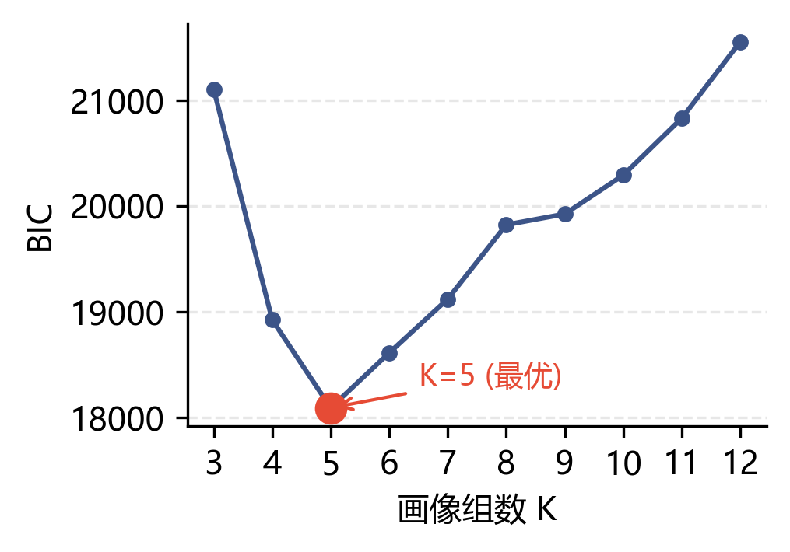
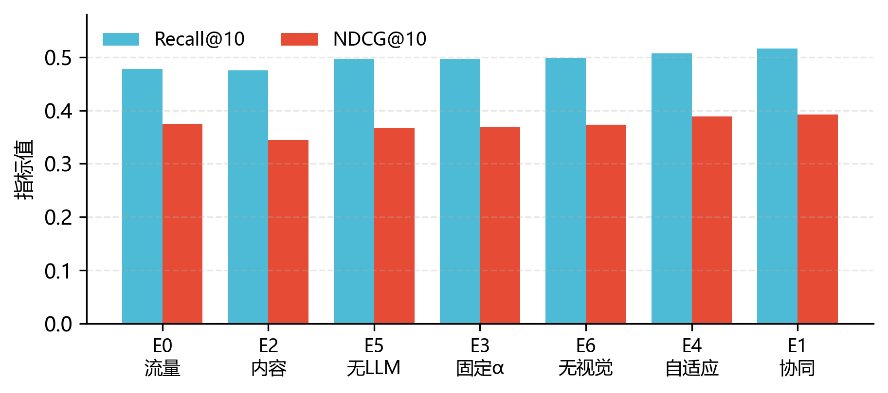
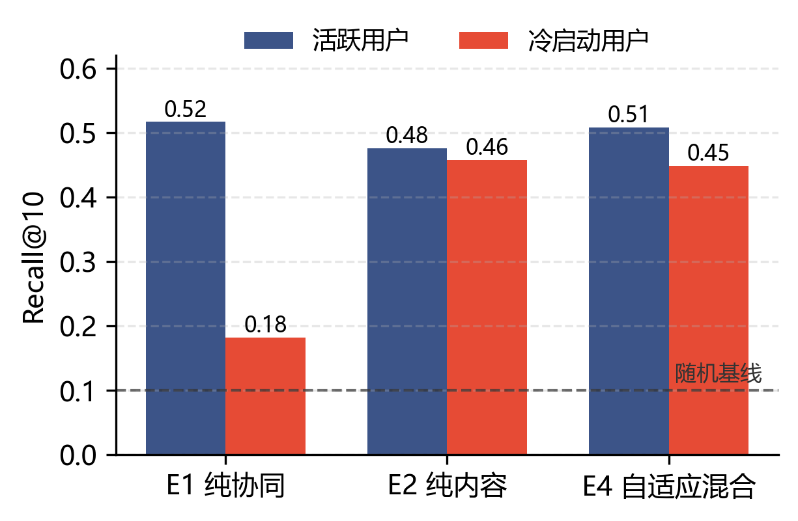

# 户外个性化游线推荐系统：阶段进展汇报

**汇报范围**：Phase 0 预探索 + Phase 1 数据资产 + Phase 2 算法核心（数据与离线评估部分）
**汇报日期**：2026 年 5 月
**项目代号**：Vispath 2.0 / TrailForge　**范围边界**：北京登山（climbing）单活动
**配套文档**：《户外个性化游线推荐系统：研究与原型开发计划》主文档

---

## 1. 本期工作概述

本期工作完成了从原始社交媒体数据到一个可评估的混合协同过滤推荐引擎的完整链路。具体而言，我们重建了用户-片段交互矩阵、构建了步道图数据结构、完成了用户表示（行为画像聚类 + LLM 文本画像）与片段表示（地理、视觉、行为三层）的全部特征工程，实现并训练了双塔加显式协同因子的混合 CF 模型，并完成了主文档第 8 章规定的 E0–E6 完整对照实验以及一项额外的冷启动专项评估。此外，规则版的路径生成器已经可以工作。

本期的核心产出是**研究结论**而非可演示系统：混合 CF 的技术路线在本数据上得到了决定性验证，但前后端服务化（`/route` API 与前端交互）尚未启动，故目前还没有可供用户试用的 Demo。

> **[一句话结论]** 在数据充足的活跃用户上，协同信号主导、内容特征几乎无增益；但在新用户（冷启动）上，协同信号完全失效、内容塔成为唯一可用信号。带自适应融合系数的混合模型是唯一在两种人群上都稳健的方案。这一"人群密度决定协同与内容强弱"的结论，构成了本工作可发表的核心论点。

---

## 2. 数据基础与处理（Module A）

本章逐项说明每个数据资产**用了什么原始数据、做了什么处理、得到什么结果**。所有原始数据位于 `G:\游憩线路生成`，处理产物存于仓库的 `data_processed/`，可从原始数据一键重建。

### 2.1 用户-片段交互矩阵的重建（D0.2）

**数据**。原始数据为六只脚户外社区的 GPS 轨迹（`track*.shp`，WGS84 未投影）、行程元信息（`basic*.xlsx`，含 `userid / triptime / triptype`）、以及胡宝生清洗得到的登山行程分类（`climbing_all.csv`）。原系统提供的现成交互链 `lypid_userid_tripid.csv` 经核验在第 1,048,576 行（恰为 Excel 行上限）被截断——其 `lypID` 只到 27,012 而片段实际到 29,940，约 2,900 段的交互缺失，因此**不可直接使用，必须重建**。

**处理**。以邓钰桥 demo 的春季 50m 中心线（`clim_春_..._AllMessage.shp`，29,941 段，坐标系 Krasovsky_1940_Albers，米制）作为基准片段几何；对每段做 25m 缓冲；将原始轨迹设为 WGS84、裁剪到北京经纬度包围盒（剔除越界的损坏坐标）、再重投影到 Albers；用空间相交（`sjoin intersects`）得到 `(tripid, lypID)` 对；与 `triptime` 解析出的季节合并；最后按 `(userid, lypID, season)` 聚合得到交互次数与首次时间戳。

> **[设计考虑]** 季节由行为而非几何承载。登山步道的几何是季节无关的，因此我们不为夏/秋/冬重新切分中心线，而是用同一套 50m 网络、按行程时间戳分季节统计行为。这避免了重复的几何处理。

**结果**。得到 **1,594,250** 条 `(用户, 片段, 季节)` 交互，覆盖 **3,630** 个用户、**29,934 / 29,941** 个片段（100%）。与旧截断 csv 在共同行程上交叉校验，召回率 **0.972**，确认重建正确。随后按主文档 §5.3.2 做每用户时间维度的 80/20 划分：训练 1,276,886 对、测试 317,364 对，其中 86.5% 的测试正样本是训练期未见过的新片段，0 起时间穿越，适合做"以历史预测未来"的排序评估。

### 2.2 步道图 TrailGraph 与一个重要的网络结构发现（D0.4）

**数据与处理**。基于 29,941 段 50m 中心线，按端点坐标对齐（snap 容差 1m）建立段级邻接表 `dict[lypID, list[lypID]]`，并实现了 `neighbors / attributes / subgraph(图距离) / shortest_path(Dijkstra) / find_nearest_segment(空间索引)` 等接口（主文档 §5.4.1），8 项单元测试全部通过。

**结果与发现**。平均邻居数 2.14、最大 5。**整个登山步道网络天然分裂为 610 个互不连通的子图**，最大子图仅 4,478 段（约 242 公里）。我们将 snap 容差从 0.5m 扫到 10m，连通性完全不变，证明这不是坐标对齐的人为假象。

> **[关键发现]** 北京登山步道在地理上分裂为众多独立山块（西山、香山、八达岭等），彼此没有步道相连。这一事实直接约束了路径生成——一条推荐路线只能落在单个连通子图内（这其实符合"一次出行待在一个山头"的直觉），但也意味着可推荐的主战场是那个 4,478 段的最大子图。这是原计划未曾意识到的结构性约束。

### 2.3 视觉层：CLIP 的搁置与彭晓场景标签的采用（D0.5）

**取舍与数据**。主文档原设计的 `s_visual` 是 CLIP 视觉 embedding 加自然语言语义评分。但跑 CLIP 必须有照片原图，而经核查：本地无原图；彭晓 2019 年的成果（`lzj_youxiao.shp`）只交付了**带 geotag 的场景分类点**，没有原图也没有 embedding；原图唯一来源是六只脚网站 2018–2019 爬虫的图片 URL，至今大概率已失效且未归档。

> **[取舍说明]** 在确认原图不可得后，我们决定**搁置 CLIP，视觉层改用彭晓的 538,848 个场景分类点**（`main_cla` 4 类 / `med_cla` 13 类 / `fine_cla` 273 类，外加拍摄日期）。这无需 GPU、无需下载原图；代价是丢失了 embedding 的丰富度和自然语言查询能力，相应地放弃了"CLIP 户外语义"这一发表方向。后续 E6 消融将量化这一层的实际价值。

**处理与结果**。将彭晓点重投影到 Albers，用 `sjoin_nearest` 把每张照片归属到 100m 内最近的片段，再按片段聚合场景类别直方图、季节分布与照片密度。结果：538,848 点中 **122,455（22.7%）** 落在步道网络附近，**9,179 段（30.7%）** 有照片覆盖，得到 54 维的视觉特征。视觉层因此只覆盖约三成片段，其余由 `has_visual` 标志位掩码、交由模型做优雅退化。

### 2.4 片段表示的三层组装（D0.6）

最终片段表示 $\mathbf{s} = [\mathbf{s}_{\text{geo}}; \mathbf{s}_{\text{visual}}; \mathbf{s}_{\text{behavior}}]$，共 **83 维**：地理层 19 维（长度、平均坡度、自然/人文景观、以及来自 demo 片段属性的 POI/设施评分共 13 个 POI 子维度，覆盖率 100%）、视觉层 53 维（彭晓直方图，覆盖 30.7%）、行为层 11 维（来自交互矩阵的流量、独立用户数、季节分布，以及"经过该片段的用户画像组分布"这一直接的画像-片段关联信号，覆盖 99.9%）。三层各自做 L2 归一化后拼接。

> 因放弃 CLIP，片段表示维度从原计划的约 540 维（embedding 占大头）降到约 83 维；又因无 DEM，未能计算爬升/下降/最高高程，地形项仅有长度与平均坡度。这两点均为已知局限。

---

## 3. 用户表示（Module B）

### 3.1 行为风格元特征聚类（D0.3 / T2.1）

**数据与处理**。按主文档 §5.1.1，从用户全部登山行程聚合 **14 个行为风格元特征**（节奏、强度、空间、多样性四族），这些特征严格只描述"用户怎么活动"、不含任何具体片段信息（即档案 A，用以规避循环论证）。在聚类前先做脏数据清洗：剔除单程距离 > 50 km 或时长 > 24 h 的 GPS 损坏行程（原始数据中曾见单程 14,159 km 的越界轨迹），共剔除 572 条；满足 ≥ 5 次出行的用户 603 个进入聚类。特征标准化后用高斯混合模型（full 协方差）在 K=3…12 上按 BIC 选模型。

**结果**。BIC 在 **K=5** 取得最优（见图 1），组规模为 64 / 75 / 83 / 193 / 188，各组在出行频率、距离、周末比例、季节熵等维度上可解读，分别对应"广域探索型 / 春季固定点型 / 夏季周末型 / 周末固定时段休闲型 / 低频远距偶发型"。脏数据清洗修复了清洗前 K=8 时出现的两个由损坏轨迹造成的伪聚类（均距 102 km、均时 21 h）。

<b>图 1</b>　用户行为画像聚类的 BIC 随画像组数 K 的变化（K=5 为最优）。

### 3.2 LLM 文本画像（T0.2 / T2.2）

**数据**。用户在上传行程时附带的标题与描述文字。603 个用户的文本聚合后中位长度 226 字，**97.2% 的用户文本 ≥ 50 字**，数据量足以支撑提取。

**处理**。设计了 18 维的画像 schema（偏好倾向、情境偏好、经验信号三类），prompt 中嵌入户外黑话词典（穿越、重装、轻装、FB、AA 等）与 few-shot 示例，调用 DeepSeek 模型。先在 25 个用户上做稳定性测试——将每人文本随机分两半各提取一次，计算两次画像向量的相关性；再对全部 586 个有文本用户批量提取。

**结果**。**split-half 一致性中位相关 0.901**（判断标准 > 0.6 为通过），分类字段一致率 0.80，**T0.2 验证通过**。批量提取 586 个画像、0 失败，得到 18 维 `u_LLM`，与画像组软分配拼接成 24 维用户表示。

> **[待验证假设的结论]** 主文档曾担心"短文本会让 LLM 输出不稳定"。从一致性 0.901 看，这一担忧在数据层面被基本排除——但"输出稳定"不等于"对推荐有用"，后者由下文的消融实验回答。

---

## 4. 混合协同过滤模型与离线评估（Module C）

### 4.1 模型与训练设置

模型为双塔加显式协同因子（主文档 §5.3）：用户塔将 24 维 $\mathbf{u}$ 经 [64,64] 投到 32 维，片段塔将 83 维 $\mathbf{s}$ 经 [256,128,64] 投到 32 维，内积得内容匹配分；协同路径为用户/片段各 32 维 ID 嵌入的内积；二者按 $\hat r = \alpha\cdot r_{\text{content}} + (1-\alpha)\cdot r_{\text{collab}}$ 融合，$\alpha$ 取固定 0.7 或可学习的 $\sigma(w_0 + w_1\log\text{cnt}(u) + w_2\log\text{cnt}(s))$。损失为 BPR，配合**地理感知负采样**（每个正样本从其 200 个最近邻片段中采负样本，学习"为何选这条而非邻近那条"）。评估按主文档 §5.3.4：每个测试正样本配 99 个地理负样本做 100 路排序，报告 Recall@K 与 NDCG@K，有效评估样本 **101,870** 个。

### 4.2 活跃用户域的完整对照矩阵（E0–E6，T2.5）

七个对照模型的 Recall@10 与 NDCG@10 见图 2（随机基线 Recall@10 ≈ 0.10）。

<b>图 2</b>　活跃用户域 E0–E6 对照（按 Recall@10 升序）。E0 流量基线、E2 纯内容、E5 无 LLM、E3 固定 α、E6 无视觉、E4 自适应 α、E1 纯协同。

由图 2 可得三个判断：其一，**纯协同 E1 最佳**（Recall@10 = 0.516），所有混合模型次之，纯内容垫底；其二，**纯内容 E2（0.475）几乎不优于非个性化的流量基线 E0（0.478）**——即在活跃用户上，内容塔对"在相邻片段中选哪条"几乎没有个性化判别力；其三，**自适应 α 的 E4（0.508）优于固定 α 的 E3（0.496）**，逼近纯协同——它学到了对高交互用户下调内容权重（$w_1<0$），把固定 α=0.7 让出的协同优势收了回来。

> **[消融结论]** E3（含 LLM）≈ E5（无 LLM）、E6（无视觉）≈ E3（有视觉），二者差异均在噪声内。**在活跃用户域，LLM 画像与彭晓视觉层的边际增益均≈0。** 进一步地，扩展用户表示从 5 维到 24 维后内容塔训练损失仅从 0.5008 微降到 0.4944——富用户特征连拟合训练排序都几乎没帮上。单看这一矩阵，结论似乎是"内容工程可以砍掉"。

### 4.3 冷启动专项评估（决定性结果）

上述矩阵的评估人群全是 ≥5 次出行的活跃用户，结构上必然偏向协同。而内容塔的设计初衷正是冷启动。为此我们做了关键的一步：随机留出 20%（120 个）用户**完全不参与训练**，其 ID 嵌入停在初始值（无协同信号），在剩余 80% 暖用户上训练，再在这些冷用户的测试正样本（18,786 条）上评估。结果见图 3。

<b>图 3</b>　活跃用户域结论在冷启动域被彻底反转。纯协同在冷用户上崩溃至近随机（0.18），纯内容保持（0.46），自适应混合两域都强。

活跃域的结论被**完全反转**：纯协同 E1 从 0.516 暴跌到 **0.182**（几近随机），而纯内容 E2 在冷用户上仍有 **0.457**，是协同的 **2.5 倍**；自适应混合 E4 在活跃域 0.508、冷启动域 0.449，是唯一在两种人群上都接近最佳的模型。

### 4.4 研究与产品结论

> **[核心结论]** 协同与内容信号的强弱**取决于人群密度**：活跃用户域协同主导、内容≈流量基线；冷启动域协同失效、内容塔决定性有用。带自适应 α 的混合模型两域鲁棒。这正是混合 CF 的教科书式理由，现在在本数据上得到实证。鉴于目标产品中新用户占比高，内容塔不是可选项而是必需品——仅凭活跃域矩阵就砍掉内容工程将是错误判断，冷启动实验纠正了这一点。
>
> **产品取向**：生产应采用 E4 自适应 α 混合——活跃用户吃协同精度、新用户靠内容兜底，单一模型覆盖全谱。
> **研究取向**："活跃域协同主导 + 冷启动内容主导 + 自适应 α 两域鲁棒"构成完整且可发表的论证链（对应主文档发表方向一）。

---

## 5. 路径生成（T1.5，规则版）

在 TrailGraph 上实现了规则评分的路径生成器：给定起点、长度预算与偏好权重，按"单位代价收益最高"逐步生长出一条连通路径。由于步道网络近似线性（平均度 2.14），朴素贪心会很快走进死胡同，故改用带回溯的最佳优先搜索生长到预算长度。测试中，"自然风光 + 风景"与"挑战性"两组偏好从同一起点生成了**显著不同**的约 4 公里路线，且路线属性与偏好对应（风景路线的照片密度更高、挑战路线的平均坡度更高），输出含 WGS84 GeoJSON 可直接上图。环线闭合、局部搜索与接入 CF 评分（T2.6）尚未实现。

---

## 6. 当前进度与下一步

**进度**。Phase 0 预探索基本完成（CLIP 以"原图不可得→改用彭晓"结案，LLM 画像通过验证）；Phase 2 算法核心已基本闭环（用户/片段表示、混合 CF、E0–E6 矩阵、冷启动评估全部完成）。Phase 1 的数据资产与规则路径生成器已就绪，但**后端 `/route` API 与前端交互尚未开工**，故暂无可演示 Demo。研究目标接近达成，产品目标卡在服务化。

**已知局限**。单次运行、尚未做多 seed 显著性；负样本为地理邻近（相对偏易）；无 DEM 故无爬升类地形特征；视觉层仅覆盖 31% 片段；范围限于北京登山单活动单连通分量。

**建议的下一步**（按价值）：

1. **多 seed（≥5）显著性 + 冷启动域内部消融**（去 u_LLM / 去视觉），把现有结论补上误差棒、并定位冷启动里究竟哪层内容真正有用——可直接产出论文核心表格。
2. **工程服务化**：将 E4 模型与 T1.5 生成器接成 `/route` API（T1.1 后端）并补前端起点点选（T1.6），让端到端 Demo 跑起来。
3. **路径生成升级**（T2.6）：接入 CF 评分、环线闭合与局部搜索。

---

## 附：本期数据与处理一览

| 环节 | 原始数据 | 处理 | 结果 |
|---|---|---|---|
| 交互矩阵 | 六只脚 track/basic + 登山分类 | 缓冲+裁剪+空间相交+季节聚合 | 1.59M 交互，3630 用户，recall 0.972 |
| 步道图 | 29,941 段 50m 中心线 | 端点 snap 建邻接 + 连通分量 | 平均度 2.14，610 子图（最大 4478） |
| 视觉层 | 彭晓 538k 场景分类点 | reproject + 100m 最近邻归属 + 直方图 | 54 维，覆盖 30.7% |
| 片段表示 | 上述三源 | 三层 L2 归一化拼接 | s = 83 维 |
| 用户聚类 | 14 维行为元特征 | 清洗 + 标准化 + GMM/BIC | 603 用户，K=5 |
| LLM 画像 | 行程标题+描述文本 | DeepSeek + 18 维 schema + 一致性测试 | 一致性 0.901，586 画像 |
| 混合 CF | u24 / s83 / 交互 | 双塔+协同+自适应α+BPR+地理负采样 | E4 活跃 0.508 / 冷启动 0.449 |
